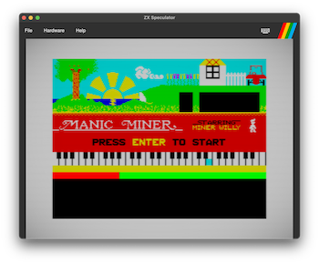
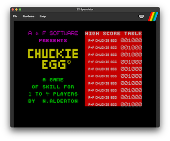
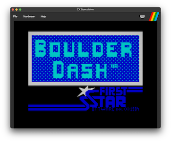
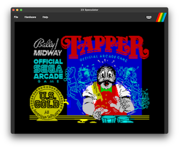
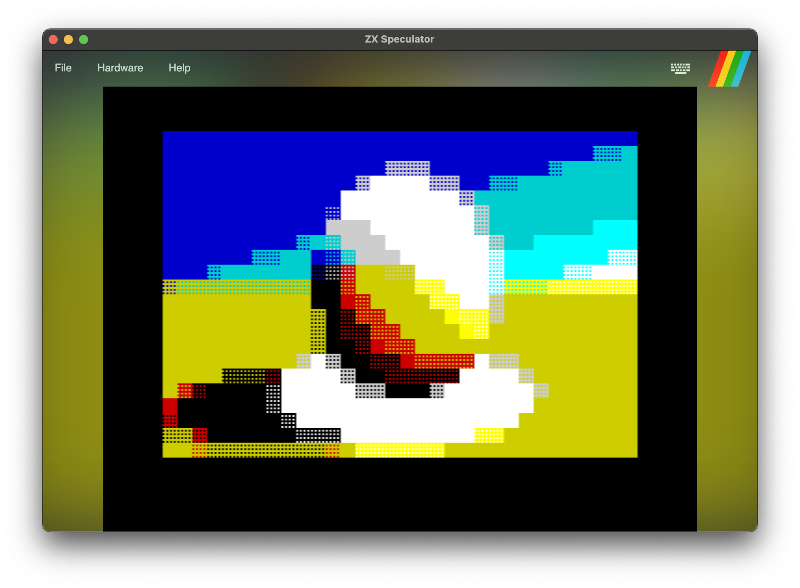
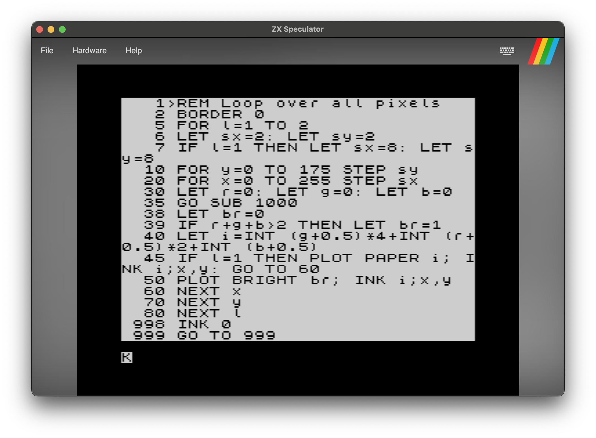

# ZX Speculator
ZX Speculator is a cross-platform ZX Spectrum 48K emulator written in C#.

## Features
- **Cross Platfom**: Built using [Avalonia](https://avaloniaui.net/), ensuring compatibility across various platforms.
- **File Format Support**: Compatible with .z80, .bin, .scr, .tap, and .sna files.
- **Archive Support**: Load files directly from `.zip` archives.
- **Display**: Optional CRT TV and 'Ambient Blur' effects.
- **Joysticks**: Kempston and Cursor joystick support.
- **Sound**: Utilizes [OpenAL](https://www.openal.org/) on Mac and Windows for sound emulation.
- **Integrated Debugger**: Includes a built-in debugger for examination of the Z80 CPU state, including:
  - Instruction stepping.
  - Breakpoints.
  - Instruction history.

## Download
* Download from the [Releases](https://github.com/deanthecoder/ZXSpeculator/releases) section.
* Mac users may need to run the following command to unblock the application: `xattr -d com.apple.quarantine /Applications/ZX\ Speculator.app`

## Development and Testing
Developed on a Mac environment, ZX Speculator is also tested on Windows and passes all the ZEXDOC tests and FUSE emulator tests.

## Getting Started
### Loading Files
Common ZX Spectrum image files (.z80, .sna, etc) can be opened from the File->Open menu.

### Loading .tap Files
1. Type `Load ""` in BASIC.
2. The File->Open dialog will automatically open, allowing a .tap file to be specified.
3. Enjoy the loading experience.

### Keyboard
Move the mouse pointer to the small keyboard icon at the top-right of the screen to see a representation of the ZX Spectrum keyboard.

Many keys on a modern keyboard are automatically mapped to their ZX Spectrum equivalent.  For example, backspace, quotes, math symbols etc.

The left shift key maps to **CAPS SHIFT** on the Spectrum, and the right shift key maps to **SYMBOL SHIFT**.

ESCape will reset the machine.

### Joystick
The emulator will mimic either a Kempston or Cursor joystick.

In both cases the keyboard arrow keys are used for direction control, and the backslash or backtick keys will 'fire'.

## Building From Source
### Prerequisites
- .NET compatible IDE, such as [JetBrains Rider](https://www.jetbrains.com/rider/) or [Visual Studio 2022](https://visualstudio.microsoft.com/vs/).
- Basic knowledge of C# and emulation concepts.

### Setup
The project is provided as C# source code:
1. Clone the repository from GitHub.
2. Open the solution (`Speculator.sln`) in your preferred IDE.
3. Build and run the application.

## Videos
There's a [YouTube playlist](https://www.youtube.com/playlist?list=PLPA1ndSnAZTwt7cQjDNwwsPjS89Dd3yqv) showing some classic games played in the emulator.

## Experiments
As my other hobby is writing GLSL shaders on [ShaderToy](https://www.shadertoy.com/user/dean_the_coder) (See [here](https://github.com/deanthecoder/GLSLShaderShrinker) for my GLSL Shader Shrinker application), I thought it'd be interesting to try a 'cross over' project.

I've taken inspiration from the [Human Shader](https://humanshader.com/) project and recreated the algorithm using ZX Spectrum BASIC, using this emulator.

Here's the result:

I've included a `.sna` snapshot of the code [here](Experiments/HumanShader/HumanShader.sna).

## Contribution and Improvements
ZX Speculator is an ongoing project and contributions are welcome. Whether it's improving emulation accuracy, testing on different platforms, or enhancing existing features, your input is valuable (although I can't always promise a fast response, as this is a side project).

## Useful Resources
- [The Undocumented Z80 Documented](http://www.z80.info/zip/z80-documented.pdf)
- [Z80 Undocumented Instructions (World Of Spectrum)](https://worldofspectrum.org/z88forever/dn327/z80undoc.htm)
- [ClrHome's Z80 Opcode Table](https://clrhome.org/table/#%20)
- [ZX Spectrum Keyboard Cheat Sheet](http://slady.net/Sinclair-ZX-Spectrum-keyboard/)
- [Z80 Instruction Exerciser (zexall, zexdoc)](https://mdfs.net/Software/Z80/Exerciser/Spectrum/)
- [JSMoo Z80 tests](https://github.com/raddad772/jsmoo/tree/main/misc/tests/GeneratedTests/z80)
---
Feel free to follow me on Twitter for more updates: [@deanthecoder](https://twitter.com/deanthecoder)